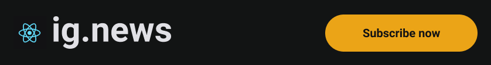
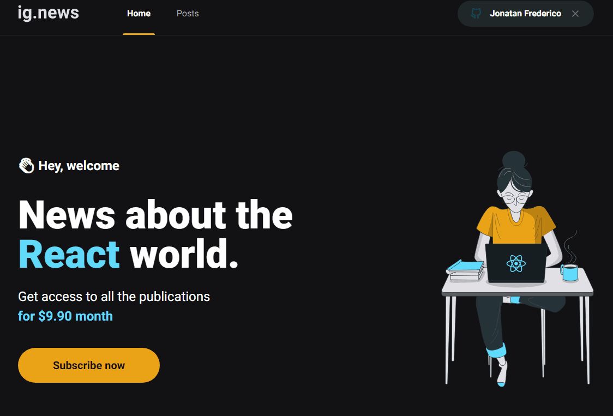

Este projeto consiste em um blog por assinatura

## 👽 Tecnologias
- NextJS
- FaunaDB
- Prismic CMS
- Next Auth
- Github OAuth

## 📷 Demonstração

## 🌍 Acesso
O projeto pode ser acessado por [este link](https://jonatan-mynews.vercel.app/).

## 📋 Licença
Você pode ver mais detalhes sobre a licença clicando [aqui](LICENSE).
